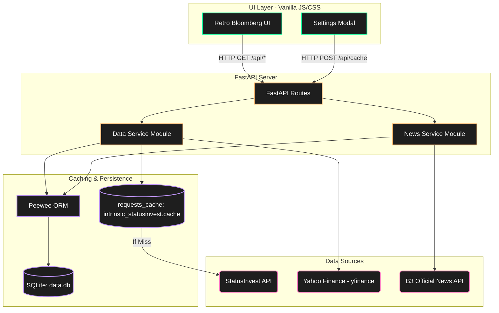
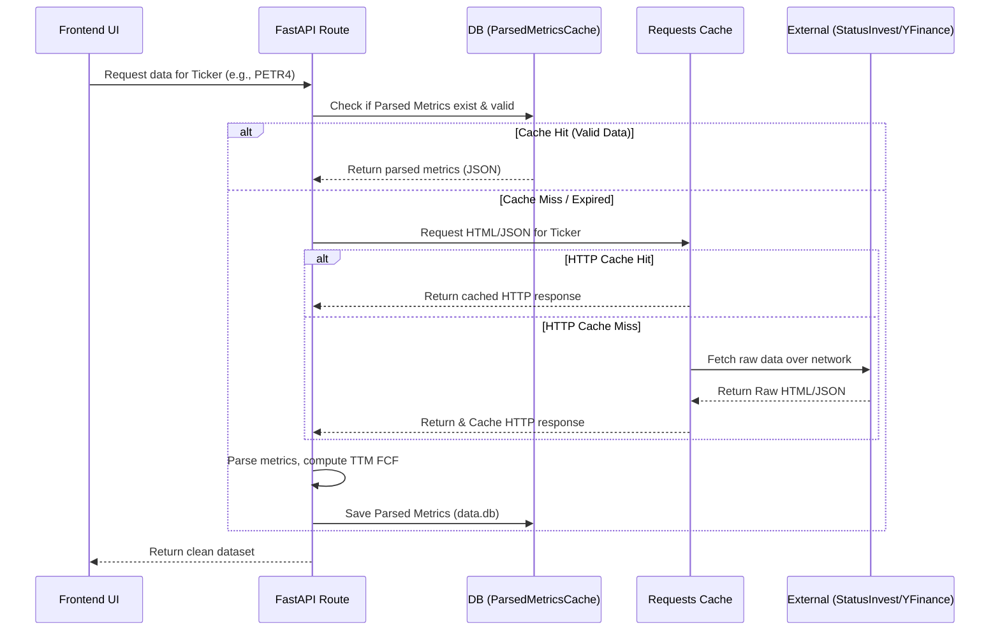
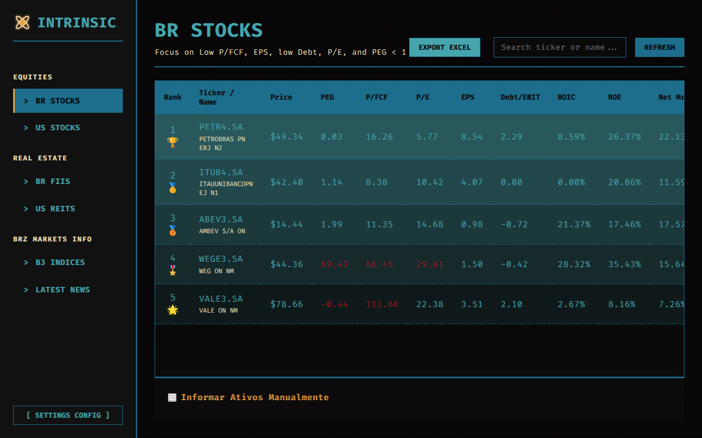
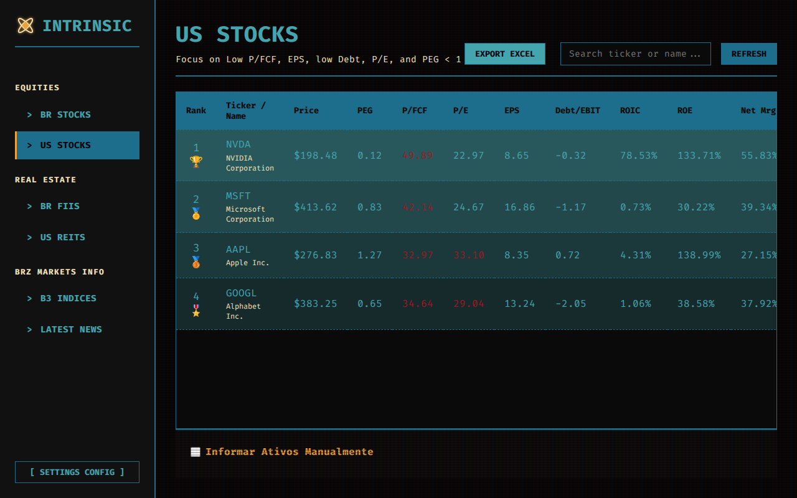
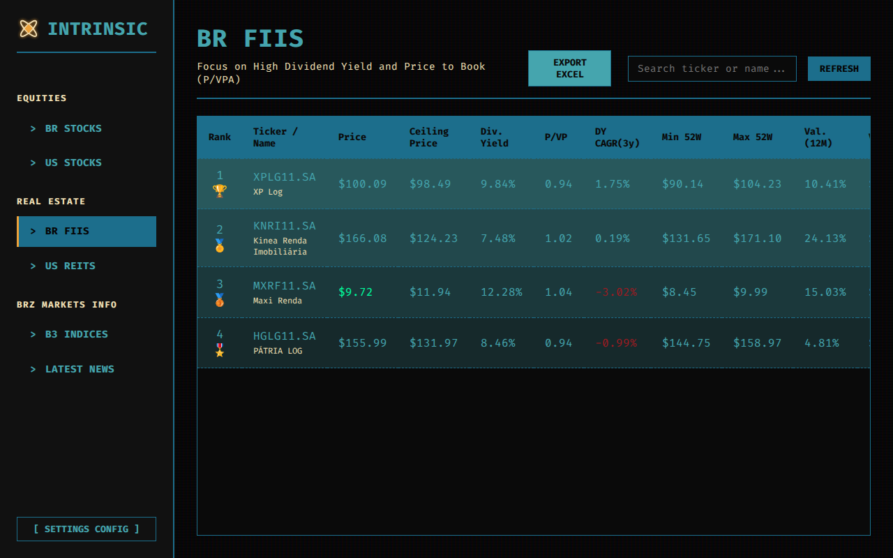
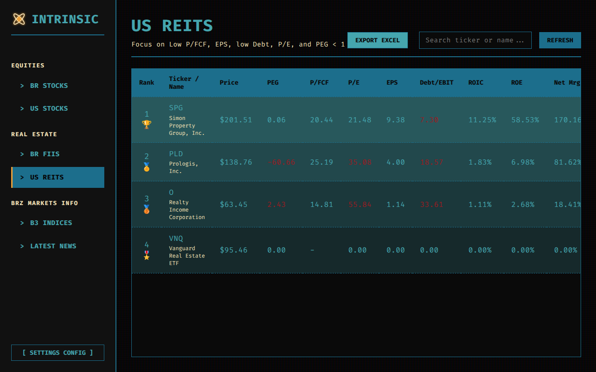
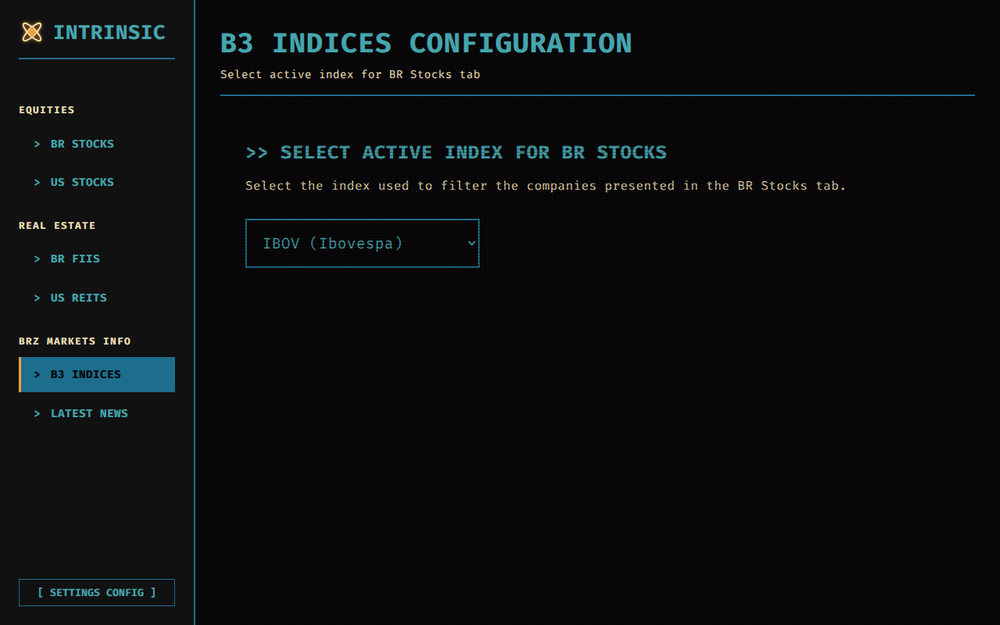
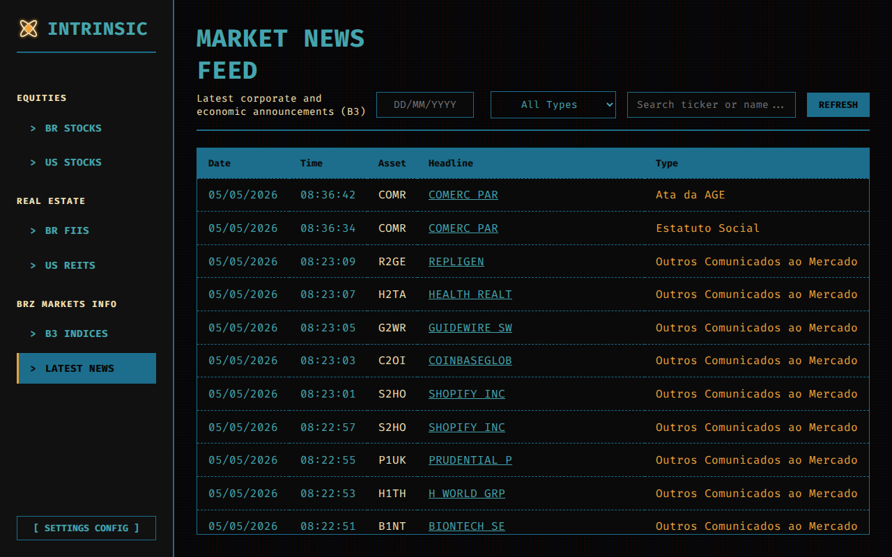
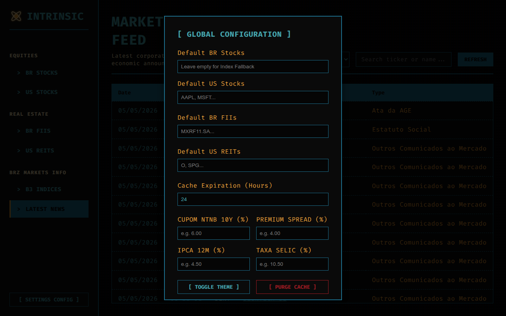

# Intrinsic Valuation Dashboard - V3 Architecture

Welcome to the **Intrinsic Valuation API & Dashboard (V3)**. This application aggregates, parses, and formats critical fundamental indicators from B3 (Brazilian Stocks/FIIs/News) and US Markets into a high-density, 1980s retro-Bloomberg styled interface.

## 🏗️ Architecture & Component Relationships

The application follows a decoupled architecture, separating the frontend visualization layer from the data-fetching and caching backend.



## 🔄 External API Consumption & Data Flow

To avoid rate-limiting and ensure ultra-fast load times, the system employs a two-tier caching strategy using `requests_cache` for raw HTTP payloads and a dedicated `SQLite` database for parsed metrics.



## 📸 Core Features & Navigation

### 1. BR Stocks (Ações Brasileiras)
The Brazilian stocks tab cross-references data from StatusInvest and Yahoo Finance. It calculates Free Cash Flow (FCF) dynamically from TTM financial statements and applies a strict ranking algorithm (prioritizing low PEG, low P/FCF, and high ROE).



### 2. US Stocks (Ações Americanas)
A dedicated view for the US Market, utilizing the same core fundamentals. It includes an **Anomaly Firewall** that intercepts hyper-inflated anomalies (e.g., Argentine ADRs displaying >1000% ROE) and falls back to reliable bounds.



### 3. BR FIIs (Fundos Imobiliários)
Specialized tab for Brazilian REITs. It features:
* **Ceiling Price Calculation**: Dynamically computed based on global macroeconomic settings (NTN-B, Spread, Selic).
* **Sharpe Ratio**: Assesses the historical risk-adjusted return of the fund against the Selic rate.
* **Smart Highlighting**: Prices below the calculated Ceiling Price are automatically highlighted in bright green (`#00FF9F`).



### 4. US REITs
An overview of US Real Estate Investment Trusts, tracking Dividend Yields, P/VPA, and price actions.



### 5. B3 Indices Configuration
Allows users to dynamically set the default composition array for the BR Stocks tab. Selecting `IBOV`, `IFIX`, or `SMLL` triggers backend logic to immediately resolve and inject the precise index ticker makeup.



### 6. Market News Feed
Features an advanced regex parsing engine that filters unstructured text directly from the B3 string pipeline. It dynamically extracts over 20+ hidden event classifications (e.g., `DEMONSTRAÇÕES FINANCEIRAS`, `AVISO AOS ACIONISTAS`) and plots them alongside the ticker.



### 7. Global Configuration
A quick-access settings modal allows the user to manually configure the default tickers for each tab, set the Cache Expiration window, and configure macroeconomic variables (NTN-B, Spread, IPCA, Selic) for advanced Intrinsic Valuation formulas.



---

## ⚡ How to run it locally

We consolidated execution. You no longer need to run multiple terminals.

**Start the Entire Engine (Backend + Frontend):**
```bash
bash start.sh
```
> The API will bind to `localhost:8000` and the web interface will stream on `localhost:3000`. To stop safely, type `CTRL+C`.

## 🧪 Running Automated Tests

To verify the integrity of the data services without making external web calls:
```bash
source venv/bin/activate
pytest -v tests/
```
